# Opdrachtomschrijving

Zoals je hebt geleerd kun je met flexbox HTML elementen op diverse manier uitlijnen, maar ook complexe layouts maken.
In de eerste opdracht ga je vooral de children (flex items) binnen de parent (flex container) uitlijnen. In het tweede
deel ga je complexere layouts bouwen door gebruik te maken van properties als `flex-basis`, `flex-grow` en `flex-shrink`. In de derde opdracht laten we je los: dan ga je een simpele webpagina maken met flexbox.
.

De HTML elementen (de containers én items) die je moet uitlijnen zijn in de eerste twee opdrachten al voor je klaargezet, zodat jij alleen de CSS
hoeft te schrijven. Benieuwd welke flexbox properties er allemaal zijn? Je vindt hier een overzicht van
alle [Flexbox properties](https://css-tricks.com/snippets/css/a-guide-to-flexbox/) uitgesplitst op properties die van
toepassing zijn op de parent (flex container) en de children (flex items).

## Inhoudsopgave

### Opdracht 1: Positioneren met Flexbox

1. [Eindresultaat](#11-eindresultaat)
2. [Randvoorwaarden](#12-randvoorwaarden)
3. [Stappenplan](#13-stappenplan)

### Opdracht 2: Layouts bouwen met Flexbox

1. [Eindresultaat](#21-eindresultaat)
2. [Randvoorwaarden](#22-randvoorwaarden)
3. [Stappenplan](#23-stappenplan)

### Opdracht 3: Webpagina met flexbox

1. [Eindresultaat](#31-eindresultaat)
2. [Randvoorwaarden](#32-randvoorwaarden)

## Opdracht 1: Positioneren met Flexbox

### 1.1 Eindresultaat

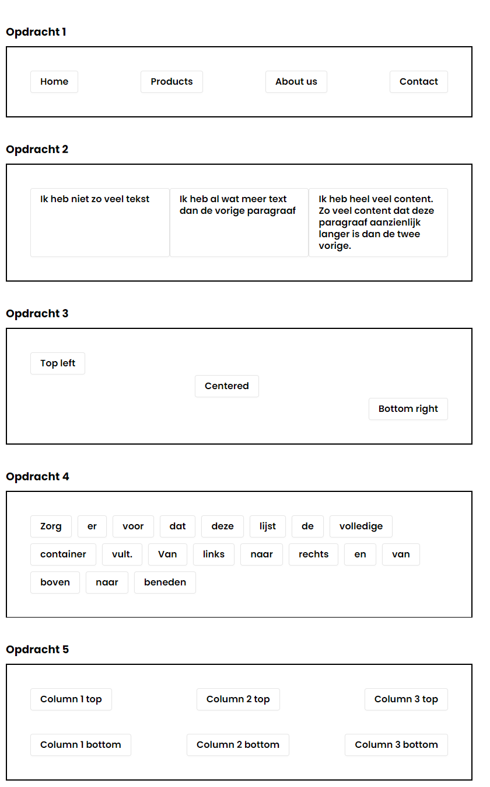

### 1.2 Randvoorwaarden

In het `index.html` bestand hebben we 5 opdrachten uitgewerkt. Zorg ervoor dat deze onderdelen er exact zo uit komen te
zien als in het voorbeeld dat erboven wordt weergegeven. De CSS voeg je toe aan
het [styles.css](deel-1-flexbox-positioneren/styles/styles.css) bestand. Loop je vast bij het maken van de opdracht?
Bekijk dan eens het stappenplan om te zien of dat je verder helpt.

* Je hoeft géén nieuwe HTML elementen te creëren, maar daar waar nodig mag je wel classes toevoegen aan de bestaande
  elementen in het [index.html](deel-1-flexbox-positioneren/index.html) bestand;
* Elke deel-opdracht heeft een eigen `section` element. Dit element is om een nieuwe deel-opdracht aan te duiden en
  gebruik je niet om je elementen op uit te lijnen. Dit doe je dus alleen op de `div`, `ul` of `li` items;
* Je mag de bestanden (`.css` & `.html`) niet verplaatsen;
* Je mag het bestand `do-not-edit` niet aanpassen. Hier zit de basis-opmaak in voor de elementen;
* Je gebruikt enkel flexbox properties om de elementen uit te lijnen, dus geen `position`, `padding` of `margin`!

_TIP_: Kom je er niet helemaal uit? Check of de parent container is voorzien van de benodigde flexbox properties en voeg
telkens 1 nieuwe property toe en kijk of dit je een stap dichter bij het eindresultaat brengt. Voeg daarna pas een
volgende property toe indien nodig.

### 1.3 Stappenplan

Vind je het lastig om te beginnen? Volg dan het stappenplan.

#### Deelopdracht 1:

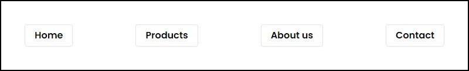

- [ ] Zorg dat het buitenste element zich gaat gedragen als een flex-container;
- [ ] Kijk naar de opbouw van de HTML-elementen en kies de hoofdrichting: moeten de elementen zich naast elkaar (`row`)
  of onder elkaar (`column`) bevinden?
- [ ] Welke property heb je nodig om elementen evenredig over de gekozen hoofdrichting te verspreiden? Tip:
  spiek [hier](https://css-tricks.com/snippets/css/a-guide-to-flexbox/#aa-justify-content) eens!

#### Deelopdracht 2:

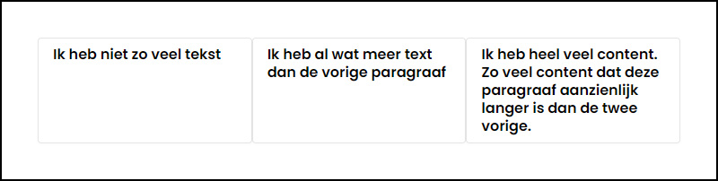

- [ ] Zorg dat het buitenste element zich gaat gedragen als een flex-container;
- [ ] Kijk naar de opbouw van de HTML-elementen en kies de hoofdrichting: moeten de elementen zich naast elkaar (`row`)
  of onder elkaar (`column`) bevinden?
- [ ] Zorg dat alle items dezelfde basis-breedte krijgen. Tip: gebruik hiervoor de `flex-basis`-property;

#### Deelopdracht 3:

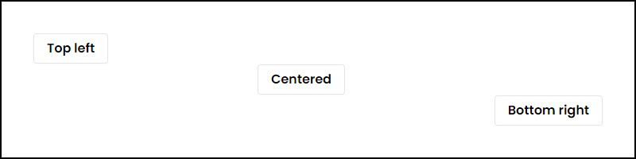

- [ ] Zorg dat het buitenste element zich gaat gedragen als een flex-container;
- [ ] Kijk naar de opbouw van de HTML-elementen en kies de hoofdrichting: in dit geval zou zowel `row` als `column`
  mogelijk zijn, maar wij hebben het met een `row`-richting gedaan!
- [ ] Zorg dat ieder item zichzelf op de juiste hoogte zet met de `align-self`-property. Tip:
  spiek [hier](https://css-tricks.com/snippets/css/a-guide-to-flexbox/#aa-align-self) eens!

#### Deelopdracht 4:

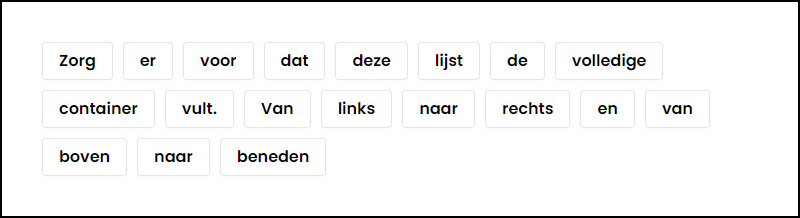

- [ ] Zorg dat het buitenste element zich gaat gedragen als een flex-container;
- [ ] Kijk naar de opbouw van de HTML-elementen en kies de hoofdrichting: moeten de elementen zich naast elkaar (`row`)
  of onder elkaar (`column`) bevinden?
- [ ] Zorg ervoor dat de elementen netjes binnen de container blijven staan, door ze naar de volgende regel te duwen
  wanneer ze niet meer passen. Tip: spiek [hier](https://css-tricks.com/snippets/css/a-guide-to-flexbox/#aa-flex-wrap)
  eens!
- [ ] Zorg ervoor dat alle elementen in de container 10 pixels van elkaar af staan. Tip:
  spiek [hier](https://css-tricks.com/snippets/css/a-guide-to-flexbox/#aa-gap-row-gap-column-gap) eens!

#### Deelopdracht 5:

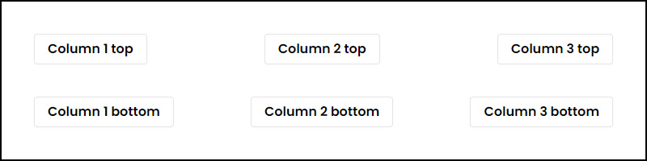

- [ ] Zorg dat het buitenste element zich gaat gedragen als een flex-container;
- [ ] Kijk naar de opbouw van de HTML-elementen en kies de hoofdrichting: moeten de elementen zich naast elkaar (`row`)
  of onder elkaar (`column`) bevinden?
- [ ] Welke property heb je nodig om elementen evenredig over de gekozen hoofdrichting te verspreiden? Tip:
  spiek [hier](https://css-tricks.com/snippets/css/a-guide-to-flexbox/#aa-justify-content) eens!
- [ ] Nu is het tijd om naar de items te gaan kijken. Hoewel zij flex-items zijn, zullen ze op hun beurt ook weer moeten
  fungeren als flex-container... Geef hen eerst een rode rand, zodat je duidelijk ziet wat je doet.
- [ ] Zorg ervoor dat alle kolommen met de rode rand zich gedragen als een flex-container;
- [ ] Hoe krijg je de elementen die erin staan vervolgens weer onder elkaar (`column`)?
- [ ] In de kolommen loopt de hoofd-as van boven naar beneden. Welke property had je ook alweer nodig om items over de
  hoofd-as te verplaatsen? Tip: spiek [hier](https://css-tricks.com/snippets/css/a-guide-to-flexbox/#aa-justify-content)
  eens!
- [ ] Als je goed oplet, zie je dat de items in de eerste kolom links uitgelijnd zijn, de items in de tweede kolom in
  het midden en de items in de rechter kolom rechts. Dit zul je dus voor iedere kolom apart moeten instellen. In de
  kolommen loopt de kruis-as van links naar rechts. Welke property had je ook alweer nodig om items over de kruis-as te
  verplaatsen? Tip: spiek [hier](https://css-tricks.com/snippets/css/a-guide-to-flexbox/#aa-align-items) eens!

## Opdracht 2: Layouts met Flexbox

### 2.1 Eindresultaat

Alle afbeeldingen (maar wel verkleind!)

### 2.2 Randvoorwaarden

In iedere opdracht-map vind je een HTML-pagina met elementen en een (leeg) CSS-bestand. Zorg er met Flexbox voor dat de
elementen zich precies zo positioneren als in het voorbeeld. Controleer hierbij ook altijd goed of de layout niet kapot
gaat wanneer je de tekst eruit haalt, of juist meer tekst toevoegt.

* Je mag niets aanpassen in de `index.html` bestanden, maar daar waar nodig mag je wel classes toevoegen aan de
  bestaande elementen.
* Je mag het bestand `global-styles.css` niet aanpassen. Hier zit de basis-opmaak in voor de layouts, waaronder de
  achtergrond kleuren van de verschillende elementen.
* Je gebruikt enkel flexbox properties om de elementen uit te lijnen, dus geen `position`, `padding` of `margin`!

_TIP_: Kom je er niet helemaal uit? Teken eerst uit welke richtingen je allemaal nodig hebt om alle items naast- en
onder elkaar te krijgen.

_TIP_: Als je `flex-shrink` of `flex-grow` properties wil gebruiken, zul je altijd eerst een `flex-basis`-waarde moeten
declareren. Hoeft het element geen specifieke breedte te hebben, maar vooral alle overgebleven ruimte opvullen? Gebruik
dan `flex-basis: auto` en wijs de juiste shrink- en grow-waardes toe.

### 2.3 Stappenplan

### Deelopdracht 1:

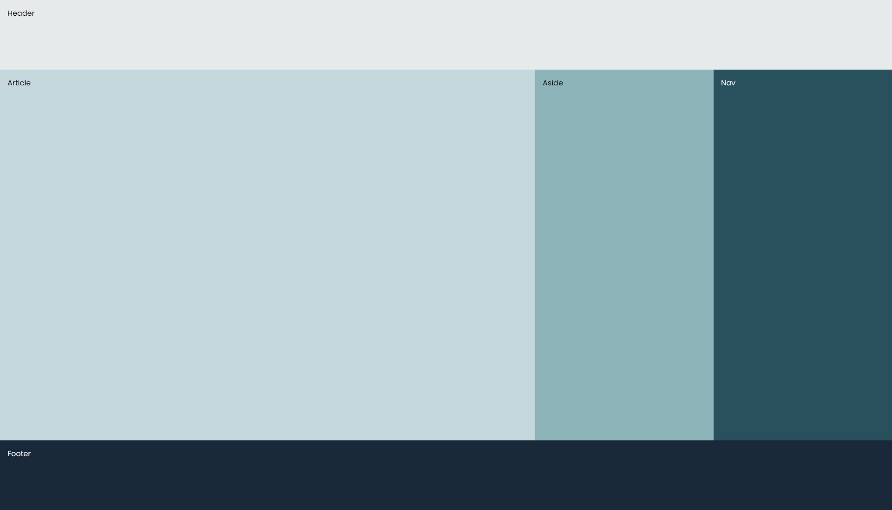

- [ ] Zorg dat de `body` zich gaat gedragen als een flex-container.
- [ ] Kijk eens goed naar de elementen in het eindresultaat. Moet de body de elementen naast elkaar (`row`) of onder
  elkaar (`column`) bevinden?
- [ ] Geef de body een minimale hoogte en gebruik daarvoor de totale _viewport height_ van je browser. Weet je niet meer
  wat dit was? Bekijk EdHub Hfst. 6.5 nog eens!
- [ ] Als het goed is, zie je nu alle elementen onder elkaar staan. Welk element moet een rij-container vormen, zodat de
  elementen daarbinnen naast elkaar komen te staan? PS: het klopt dat de volgorde van je `nav` en `aside` nog niet
  overeenkomt met het voorbeeld, dit passen we later aan!
- [ ] Geef alle elementen een `flex-basis` property. Onthoud dat wanneer elementen in een `column`-container staan, deze
  waarde iets zegt over de hoogte. Wanneer elementen in een `row`-container staan, zegt deze waarde iets over de
  breedte.  _TIP_: je kunt de waarde van flex-basis in een `column`-container beter uitdrukken in absolute waardes (
  zoals pixels) en in een `row`-container beter in relatieve waardes (zoals `vw` of procenten). Voor elementen die geen
  vaste hoogte/breedte hebben (zoals vaak bij het `main` element het geval is), mag je de waarde `auto` gebruiken.
- [ ] Gebruik de `flex-grow` en `flex-shrink` properties om ervoor te zorgen dat de `header` en `footer` niet groeien of
  krimpen.
- [ ] Gebruik de `flex-grow` en `flex-shrink` properties om ervoor te zorgen dat de `main`, `nav`, en `aside` wel mogen
  groeien, maar niet krimpen.
- [ ] Gebruik de `flex-grow` en `flex-shrink` properties om ervoor te zorgen dat de `article` zowel kan groeien als
  krimpen.
- [ ] Als laatste zullen we de volgorde van de verschillende elementen moeten aanpassen. Weet je nog welke property je
  hiervoor op de flex-items moet plaatsen? _TIP:_
  spiek [hier](https://css-tricks.com/snippets/css/a-guide-to-flexbox/#aa-justify-content) eens onder de flex-item
  properties;
- [ ] Controleer of de layout er nog steeds goed uitziet als je bijvoorbeeld 500 worden toevoegt aan het artikel. _TIP:_
  type `lorem500` + TAB om een placeholder-tekst van 500 worden te genereren

### Deelopdracht 2:

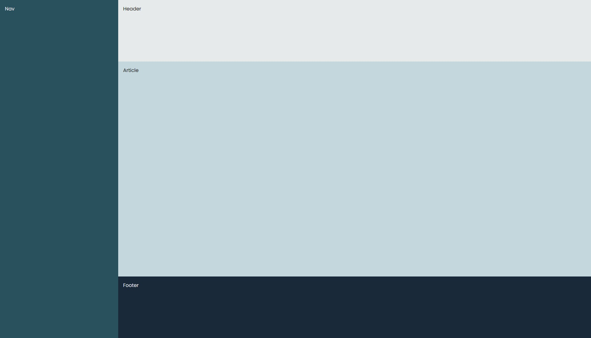

- [ ] Zorg dat de `body` zich gaat gedragen als een flex-container.
- [ ] Kijk naar de opbouw van de HTML-elementen en kies de hoofdrichting: moeten de elementen zich naast elkaar (`row`)
  of onder elkaar (`column`) bevinden?
- [ ] Geef de body een minimale hoogte en gebruik daarvoor de totale _viewport height_ van je browser;
- [ ] Zorg dat de `div` en de `main` zich ook als een flex-container gaan gedragen. Geef deze elementen ook de
  juiste `flex-direction`, zodat de elementen zich onder elkaar positioneren;
- [ ] Geef alle flex-items een `flex-basis` property. Onthoud dat wanneer elementen in een `column`-container staan,
  deze waarde iets zegt over de hoogte. Wanneer elementen in een `row`-container staan, zegt deze waarde iets over de
  breedte. _TIP_: je kunt de waarde van flex-basis in een `column`-container beter uitdrukken in absolute waardes (zoals
  pixels) en in een `row`-container beter in relatieve waardes (zoals `vw` of procenten). Voor elementen die geen vaste
  hoogte/breedte hebben (zoals vaak bij het `main` element het geval is), mag je de waarde `auto` gebruiken.
- [ ] Gebruik de `flex-grow` en `flex-shrink` properties om ervoor te zorgen dat de `nav`, `header` en `footer` niet
  groeien of krimpen.
- [ ] Gebruik de `flex-grow` en `flex-shrink` properties om ervoor te zorgen dat de `div` en de `main` zowel mogen
  groeien als krimpen.
- [ ] Controleer of de layout er nog steeds goed uitziet als je bijvoorbeeld 500 worden toevoegt aan het artikel, of
  juist alle tekst verwijderd.

### Deelopdracht 3:

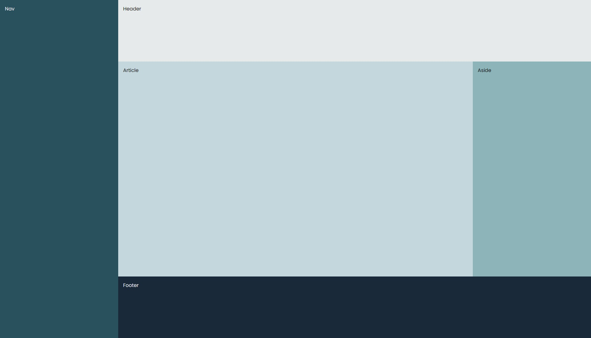
Zoals je kunt zien lijkt de opmaak van deze opdracht veel op de vorige... Om de flex-items in de `main` na, hebben zij
dezelfde de `flex-grow` en `flex-shrink` properties. Alleen de `aside` mag niet groeien of krimpen, maar `article` mag
juist wel groeien en krimpen.

Lukt het je om de layout zonder hulp te kunnen maken? Zo nee, spiek dan even bij de stappen van opdracht 2.

### Deelopdracht 4:

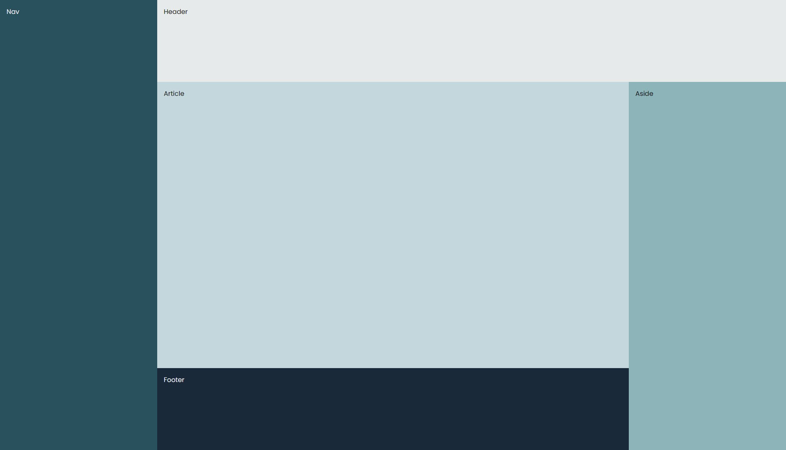

- [ ] Zoals je kunt zien wordt de layout al wat complexer. Bekijk eerst goed hoe de elementen in het HTML-document zijn
  genest, voor je begint met positioneren.
- [ ] Zorg dat de `body` zich gaat gedragen als een flex-container.
- [ ] Kijk naar de opbouw van de HTML-elementen en kies de hoofdrichting: moeten de elementen zich naast elkaar (`row`)
  of onder elkaar (`column`) bevinden?
- [ ] Geef de body een minimale hoogte en gebruik daarvoor de totale _viewport height_ van je browser;
- [ ] Kijk goed welke andere elementen ook een flex-container moeten zijn, en welke richting zij nodig hebben. Teken dit zo nodig voor jezelf
  uit.
- [ ] Geef alle flex-items een `flex-basis` property. Onthoud dat wanneer elementen in een `column`-container staan,
  deze waarde iets zegt over de hoogte. Wanneer elementen in een `row`-container staan, zegt deze waarde iets over de
  breedte.
- [ ] Gebruik de `flex-grow` en `flex-shrink` properties om ervoor te zorgen dat de `nav`, `header`, `aside` en
  de `footer` niet groeien of krimpen.
- [ ] Alle overige flex-items mogen zowel groeien als krimpen.
- [ ] Controleer of de layout er nog steeds goed uitziet als je bijvoorbeeld 500 worden toevoegt aan het artikel, of
  juist alle tekst verwijderd.

### Deelopdracht 5:

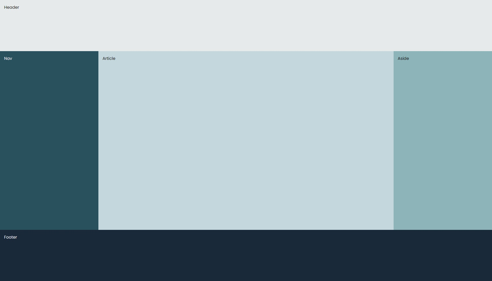

- [ ] Zorg dat de `body` zich gaat gedragen als een flex-container.
- [ ] Kijk naar de opbouw van de HTML-elementen en kies de hoofdrichting: moeten de elementen zich naast elkaar (`row`)
  of onder elkaar (`column`) bevinden?
- [ ] Geef de body een minimale hoogte en gebruik daarvoor de totale _viewport height_ van je browser;
- [ ] Kijk goed welke andere elementen ook een flex-container moeten zijn, en welke richting zij nodig hebben. Teken dit zo nodig voor jezelf
  uit.
- [ ] Geef alle flex-items een `flex-basis` property. Onthoud dat wanneer elementen in een `column`-container staan,
  deze waarde iets zegt over de hoogte. Wanneer elementen in een `row`-container staan, zegt deze waarde iets over de
  breedte.
- [ ] Gebruik de `flex-grow` en `flex-shrink` properties om ervoor te zorgen dat de `nav`, `header`, `aside` en
  de `footer` niet groeien of krimpen.
- [ ] Alle overige flex-items mogen zowel groeien als krimpen.
- [ ] Controleer of de layout er nog steeds goed uitziet als je bijvoorbeeld 500 worden toevoegt aan het artikel, of
  juist alle tekst verwijderd.

## Opdracht 3: Landingspagina

### 3.1 Eindresultaat (deel 1)

#### Breed scherm
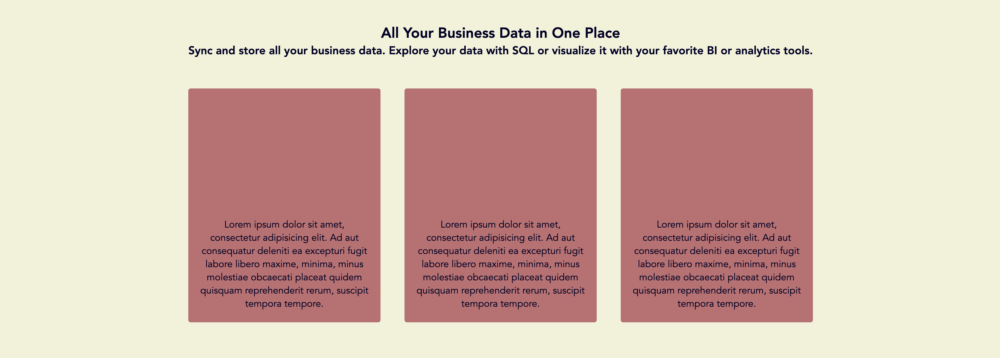
#### Smaller scherm
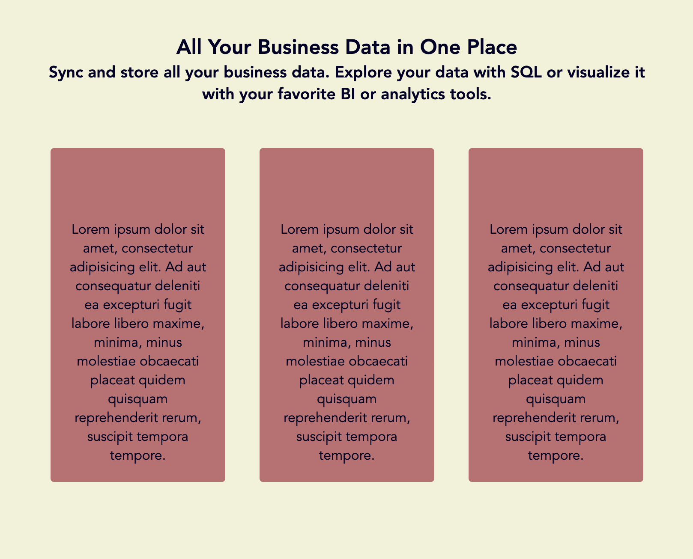

### 3.2 Randvoorwaarden (deel 1)
* De kleuren die gebruikt zijn komen uit [dit palet](https://coolors.co/151e3f-030027-f2f3d9-dc9e82-c16e70). Het lettertype mag je zelf uitkiezen.
* De titels hebben we er alvast ingezet, maar de andere elementen mag je zelf maken. Je gaat nu dus zowel aan de slag in het CSS-bestand, als in het HTML-bestand.
* Zorg dat in ieder rood blok een element is, met daarin een `
`-element van 30 woorden. Deze tekst moet altijd aan de **onderkant** van het blok staan. Deze rode blokken mogen maximaal 280 pixels breed worden en evenredig krimpen als er minder ruimte beschikbaar is. Ze moeten altijd `350px` hoog zijn.
* Zorg dat alle tekst en blokken in het midden van de pagina worden uitgelijnt. Gebruik hier geen `margin: 0 auto` voor, maar maak gebruik van flexbox!
* Let op: je hoeft geen gebruik te maken van media-queries.

### 3.3 Eindresultaat (deel 2)
De landingspagina begint langzaam vorm te krijgen. Je gaat deze pagina nu uitbreiden met een navigatiebalk. Dit doe je uiteraard in hetzelfde bestand. Deze navigatiebalk staat boven de rest van de content en ziet er zo uit:

#### Breed scherm
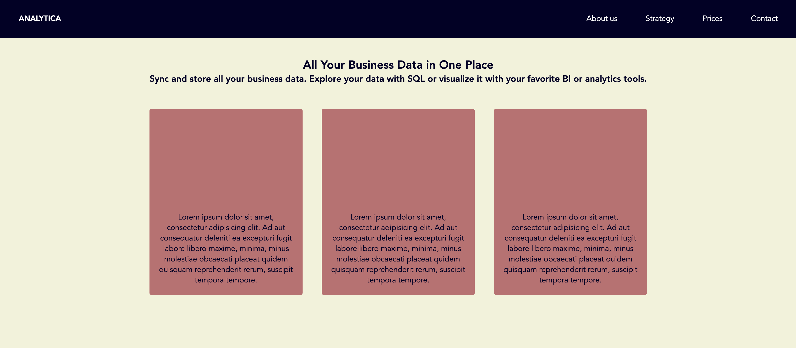
#### Smaller scherm
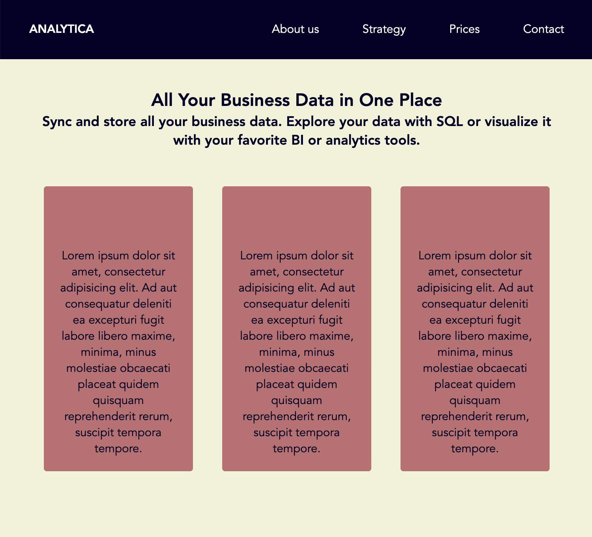

### Randvoorwaarden
* De content staat minimaal 40 pixels van de rand van het scherm af, zowel in de navigatiebalk als op de pagina zelf.
* Let op: je hoeft géén gebruik te maken van media-queries.

